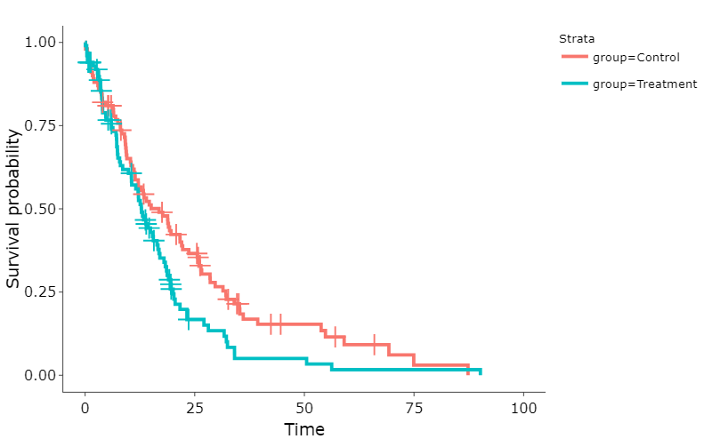

# ClinicalTrial — SurvivalAnalysis: TreatmentGroupComparison

## 🎯 Objective

This repository contains a comprehensive survival analysis comparing Control vs. Treatment groups in a clinical trial setting, featuring:

✔ Kaplan-Meier survival curves with risk tables

✔ Log-Rank test for between-group comparisons

✔ Cox Proportional Hazards regression with Hazard Ratios

✔ Comprehensive model diagnostics and assumptions testing

The analysis determines treatment efficacy and quantifies survival differences with 95% confidence intervals.

---

## 🧰 Technologies

- **Language**: R  
- **Main Packages**:  
  - `survival` – Survival models and tests 
  - `survminer` – Publication-quality KM plots
  - `tidyverse` – Model tidying  
  - `gtsummary` – Data wrangling and visualization 
 - **Reporting Packages**:  
  - `gtsummary` – Clinical tables 
  - `flextable` – Custom table formatting
  - `officer` – MS Word integration
  - `rmarkdown` – Data report and presentation
  - **Model Diagnostics**:  
  - `cox.zph` – Proportional hazards testing
  - `rms` – Extended modeling

---

## 📊 Analysis Workflow

1. Data Preparation
2. Primary Analysis: Kaplan-Meier estimation with survfit()| Log-Rank test via survdiff() | Cox PH modeling with coxph()
3. Secondary Analysis: Subgroup analyses by stratification| Time-dependent covariates | Competing risks assessment
4. Output Generation: KM plots with 95% confidence bands | Forest plots for hazard ratios | Model diagnostics visualizations

---

## 📝 Example Output

### Log-Rank Test Comparison
| **Characteristic**       | **Control N = 100¹** | **Treatment N = 100¹** | **p-value²** |
|---------------------------|----------------------|------------------------|--------------|
| **Observed Events**       | 82                   | 80                     |              |
| **Expected Events**       | 96.3                 | 65.7                   |              |
| **Test Statistic (χ²)**   | 5.5                  |                        | 0.02         |

### Cox Proportional Hazards Model
| **Characteristic**       | **HR (95% CI)**      | **Coefficient (SE)**    | **p-value**  |
|---------------------------|----------------------|-------------------------|--------------|
| **Treatment Effect**      | 1.46 (1.06 - 1.99)   | 0.375 (0.161)           | 0.0199       |
| **Model Fit Statistics³** |                      |                         |              |
| - Concordance             | 0.537 (SE = 0.023)   |                         |              |
| - Likelihood Ratio Test   | χ² = 5.39 (1 df)     |                         | 0.02         |

¹ Total number at risk in each group.  
² Log-rank test p-value.  
³ Additional tests: Wald test χ²=5.42 (p=0.02), Score test χ²=5.48 (p=0.02).

